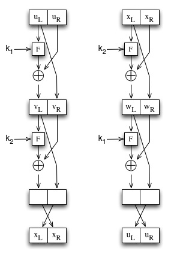

= Network Security Class Lab Session 1

== Implementing the decryption procedure
Instead of copy/pasting the code, I slightly modified the original
`feistel_encrypt` function so that it can work *both as an encryptor and as a
decryptor* (thus renaming it `feistel_encdec`). +
Since the only difference in encryption and decryption algorithms is the order
in which subkeys are generated (one being the reverse of the other), it
seemed almost natural to try to implement a single procedure with the
capability of accepting a flag that can reverse the order of the subkey
generation.

To do this, we need to manipulate the `subkey_cyclic_rotation` function, since
its original implementation is _"round-agnostic"_: that is, its output depends
only on the current input but not on the round number. This is a correct
formulation that strictly resembles the general block diagram of a Feistel
cipher, but it doesn't allow us to get keys in reversed order if not by
generating all the keys upfront and iterating over them backwards. Looking at this
function with a more software-oriented eye, though, we can see that it can be
modified so that its output can be _"round-aware"_. +
In fact, the output of this function is built by splitting the
input array into two halves and by rotating them "outward" by 1 bit (1 bit
+ROL+ for 1st half, 1 bit +ROR+ for 2nd half). +
If we compare the output of this function at round latexmath:[j] with the
original key latexmath:[k],
we see that the subkey latexmath:[k_j] is just the original key latexmath:[k], splitted in two halves
and outward-rotated by latexmath:[j] bits (assuming latexmath:[j] starts from 1).
This tells us that if we parametrize the amount of bits rotated by the 
function, we can obtain a general subkey latexmath:[k_j] with a single call. +
The resulting function is called `half_outward_shift`; to use it in the
new Feistel encryptor/decryptor procedure, we need to modify the code so that
it passes the correct parameters to it.

If we just want to retain the original behavior of the `feistel_encrypt` 
function, we only need to eval at each round `subkey_generation` with the
original key and round number as parameters. +
However, we also need to use the same cycle to perform ciphertext decryption. +
This can be done by replacing the plain round number latexmath:[i] passed to the subkey
generation function with the function latexmath:[abs(i - D)], where
latexmath:[D] is a constant that
evaluates to `0` if we want to encrypt the input, and to `nr_rounds` if we're
going to decrypt the message.

As a recap, we:

* created a new subkey generation function `half_outward_shift` which can
calculate subkey latexmath:[k_j] with a single call starting from original key and round
number
* renamed `feistel_encrypt` to `feistel_encdec` and modified it so that it can
perform both encryption and decryption by setting a flag parameter
* wrapped calls to `feistel_encdec` into two helper functions `feistel_encrypt`
* and `feistel_decrypt`

To prove that the resulting code is correct, it is sufficient to perform the
decryption of the encrypted message a certain number of times over a certain
number of random messages and see that the result of the composition of the
functions equates to the original message:

[source,matlab]
for i = 1:very_large_number
  msg = dec2hex(randi([0,2^32-1],1,1))
  assert(isequal(
    msg,
    feistel_decrypt(
      feistel_encrypt(msg, key, 4, @linear_round_function, @half_outward_shift), 
      key, 4, @linear_round_function, @half_outward_shift),
    'u and u_hat are supposed to be equal'))
end

== Linear cryptanalysis
=== Mathematical model
Since it's a given assumption that the cipher implemented using
`@linear_round_function` is indeed linear, we can treat the encryptor as a
linear system and analyze it with the binary version of a _pulse train_. In our
case, given latexmath:[k \in \mathbb{B}^{32},\: u \in \mathbb{B}^{32},\: x \in
\mathbb{B}^{32}] (respectively, the key, plaintext message and
ciphertext), we can model the encryptor as:

[latexmath]
++++
\[x = \mathbf{A}k + \mathbf{B}u \] 
++++

where latexmath:[\mathbf{A}] and latexmath:[\mathbf{B}] are two latexmath:[(32 \times 32)]
square matrices such that latexmath:[\mathbf{A},\mathbf{B} \in \mathbb{B}^{32} \times \mathbb{B}^{32}].

That said, under the assumption that latexmath:[\mathbf{A}] is non-singular we
can find the solution of the linear system for a given known
plaintext-ciphertext as:

[latexmath]
++++
\[k = \mathbf{A}^{-1}(x - \mathbf{B}u)\]
++++

In this case, since the system is linear, we need to solve this system only for
one given plaintext-ciphertext pair. Solving the system for all the other pairs
must give the same key.

=== System Analysis
With this structure in mind, we now have to derive the two matrices from the
practical implementation to fill in the model and actually obtain the
information we're looking for. +
Deriving the two matrices can be done in two symmetric steps that apply the
following idea to both the plaintext and the key:

. We set one of the two inputs of the encryptor block to the 4-words binary
representation of `0` (i.e. **`00000000`**)
. We let the other input to be the binary representation of the number `1`,
also as a 4-word message (i.e. **`00000001`**)
. We run the encryptor with these particular inputs. It can be easily seen
that the output is the value of the 31st column of either the
latexmath:[\mathbf{A}] or latexmath:[\mathbf{B}] matrix, depending on how we
initialized the inputs
. We iterate all of the above over the inputs updated as follows:
  * The input set to `0` remains the same
  * The pulse input is left-shifted by 1 bit.

If we memorize the columns obtained as ciphertexts, after shifting the pulse
array by its whole length we can obtain the full latexmath:[\mathbf{A}] or
latexmath:[\mathbf{B}] matrix. Then, we can just perform the same procedure
another time swapping the roles of the two ipnuts to obtain the other missing
matrix.

=== Implementation Caveats
We developed our model under the assumption of matrix latexmath:[\mathbf{A}]
being invertible. Unfortunately, it turns out that wht the given Feistel cipher
implementation, the key multiplication matrix doesn't have full rank but
instead has **2 linearly dependent** rows/columns. This prevents us to invert
the latexmath:[\mathbf{A}] matrix. Still, we can get over this problem by using
the `gflineq` function in Matlab, which finds a particular solution of the
linear equation latexmath:[\mathbf{A}x = \mathbf{b}] over a Galois field of
given (prime number) size.

It is worth noting how this little complication in the resolution of the
system enevtually proves the cipher to be even weaker than supposed: in fact,
since latexmath:[rank(\mathbf{A}) = 30], 2 of the 32 bits the key is composed
of are dependent of the others, so the key space an attacker has to search in is
reduced by a factor 4. This doesn't give a direct advantage to the cryptanalyst
in this case, since solving the linear equation is a more efficient way to
break the system; however, it will be shown later how this helps in breaking
the nearly-linear Feistel cipher.

=== Attack Implementation
The impulse response of the system is calculated in the `impulse_response`
function. It outputs the two matrices latexmath:[\mathbf{A}] and
latexmath:[\mathbf{B}]. This function is then called by the
`feistel_linear_cryptanalysis` script, which calculates the key for the first
known-text pair and then compares it with the other known pairs as a proof of
correctness.

The key resulting from running the cryptanalysis script with the KPA set #3 is:

----
  C3F8177E
----

== Nearly-linear cryptanalysis (4 rounds, 8 bits)
== Nearly-linear cryptanalysis (2 rounds, 32 bits)
Since only 2 rounds are performed here, we can use a _meet in the middle_
technique. +
That is, we can exploit the relation between plaintext and ciphertext and try
to invert this relation in a fashion similar to what we've done with the linear
cipher.

Let's start by analyzing the structure of the particular Feistel cipher under
the circumstances given by the assignment. +

By looking at the figure, we can setup the following equations (2 pairs for the
encryptor, 2 pairs for the decryptor):

[latexmath]
++++
\[v_L = F(u_L, k_1) \oplus u_R \qquad v_R = u_L \qquad x_R = F(v_L, k_2) \oplus v_R \qquad x_L = v_L\]
\[w_L = F(x_L, k_2) \oplus x_R \qquad w_R = x_L \qquad u_R = F(w_L, k_1) \oplus w_R \qquad u_L = w_L\]
++++

Then, by expanding the first 4 equations we see that:

[latexmath]
++++
\[ x_R = F(v_L, k_2) \oplus u_L \qquad x_L = F(u_L, k_1) \oplus u_R \]
\[ x_R = F(x_L, k_2) \oplus u_L \qquad x_L = F(u_L, k_1) \oplus u_R \]
++++

Then, by XORing on both sides of the equations we obtain:

[latexmath]
++++
\[x_L \oplus u_R = F(u_L, k_1)\]
\[x_R \oplus u_L = F(x_L, k_2)\]
++++

The same result can be obtained by exploting the relationships in the last 2
pairs of equations coming from the decryptor's model.

We can see how the left term of both equations is well-known; if we had a way
to calculate the inverse of the round function with respect to the two subkeys,
then we could simply retrieve the key given one known text pair. This, however,
can't be done in this case in a deterministic way since the round function is
non-linear. Nonetheless, we can make the relation between the round function's
arguments explicit and see that we can still gather few bits of information
given a known text pair. We begin by writing down the bitwise expression for F.
Given:

[latexmath]
++++
\[w = F(k, y)\]
++++

and

[latexmath]
++++
\[w = w_{15} \; w_{14} \; ... \; w_1 \; w_0\]
\[y = y_{15} \; y_{14} \; ... \; y_1 \; y_0\]
\[k = k_{31} \; k_{30} \; ... \; k_1 \; k_0\]
++++

then

[latexmath]
++++
\[w_{2j} = y_{2j} \vee (k_{2j} \oplus k_{2j+1})\]
++++

(that is, each output bit is the OR between the input bit at same position and
the XOR of a pair of adjacent bits of the key).

That said, we can look at the truth table of the OR function and infer the
following:

[latexmath]
++++
\[\forall j : y_{2j} = 0 \Rightarrow k_{2j} \oplus k_{2j+1} = w_{2j}\]
++++

so, we have a way to infer valid linear equations between bits of the key (note
that we have to account for different subkeys being used in different rounds;
this is easy to handle since we know how the bits positions change between
subkeys). 
We can then collect each valid equation and put it in a system; in the ideal (from
the attacker standpoint) case, we then obtain a full rank system of linear
equations that can be easily solved to recover all key bits. +
However, since there's no guarantee of obtaining a good amount of linearly
independent equations, we need to account for a certain amount of freedom when
solving the system.

In fact, in the given case, applying this technique holds a matrix of rank
**29** instead of the expected **30**. A step further can then be done by also
collecting those expressions that didn't allow us to infer valid equations for
the system; then, they can be appended to the matrix by manually setting the
corresponding known value each time at a different value. This way we can
perform a brute force attack just on the part of the problem we can't gather
information about. This allows to reduce the search space from
latexmath:[2^{32}] to latexmath:[2^2] bits.

=== Matlab vs Octave Issues and Workarounds
http://read.pudn.com/downloads64/sourcecode/others/224341/ldpc_toolkit/gflineq.m__.htm
